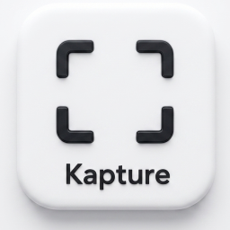
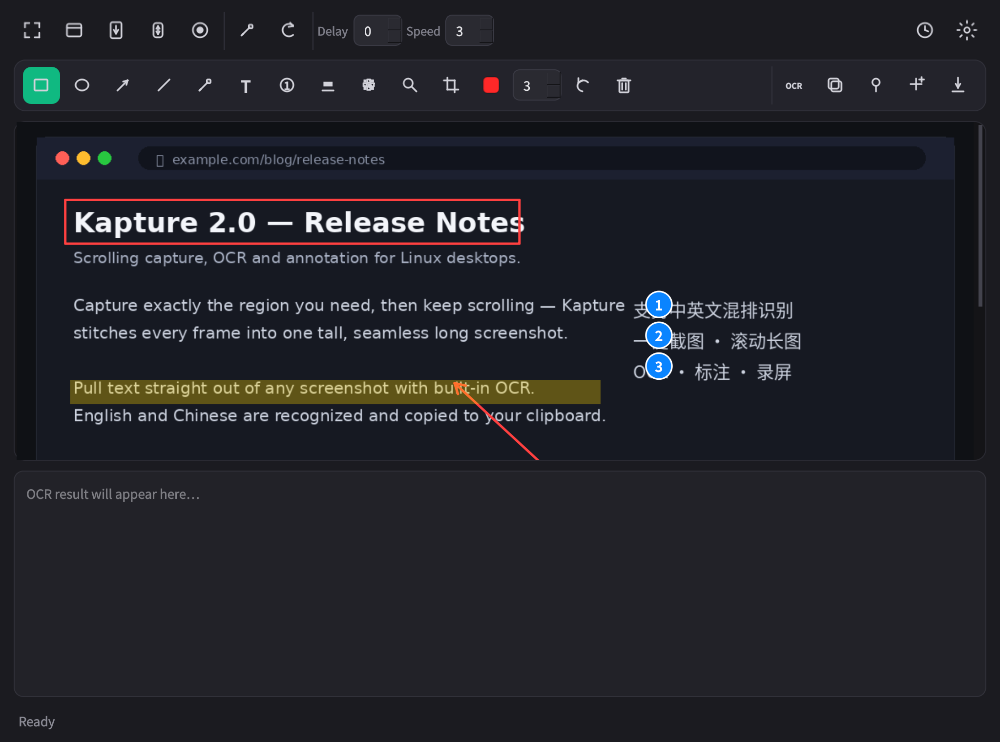
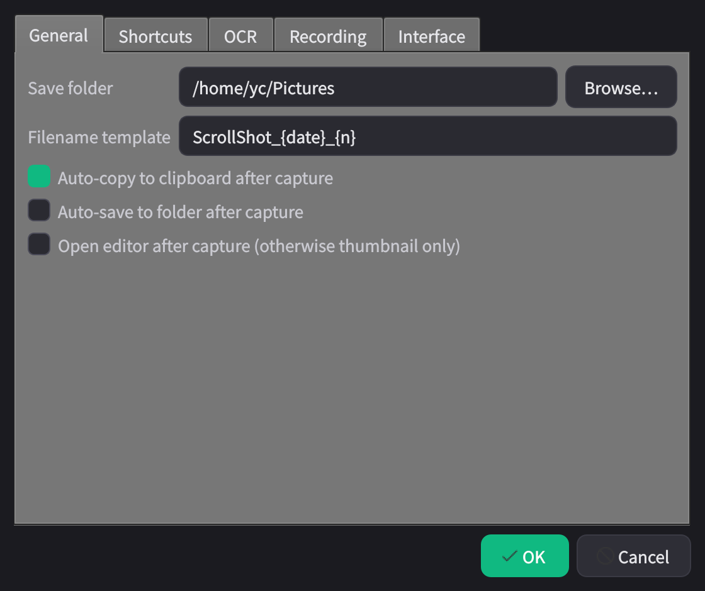

<div align="center">



# Kapture

**Linux（X11）下一体化的 截图 · OCR · 录屏 工具。**

区域 / 窗口 / **滚动长截图**、图片标注、内置 **OCR 中英文识别**、录屏、钉图到屏幕、美化导出 ——
全部集成在一个轻量的 PyQt5 应用里。

[English](README.md) · [简体中文](README.zh-CN.md)


[](https://github.com/ycwei5/kapture/pulls)

</div>

---

<div align="center">



<sub>编辑器：一张滚动长截图，配上箭头、方框、高亮、序号、打码，再一键 OCR。</sub>

</div>

## Kapture 是什么？

**Kapture** 是一款免费开源的 **Linux 截图工具**，把截图、**滚动长截图**、**OCR 文字识别**、
图片标注和**录屏**整合进同一个键盘驱动的应用里。它用 Python + PyQt5 编写，面向 **X11** 桌面，
如 **Kubuntu、Ubuntu、KDE Plasma**。

如果你在找 Linux 上类似 Snipaste、ShareX、Flameshot 的工具，或者一款
**带 OCR 的 Linux 滚动截图 / 长截图工具**，Kapture 正是为此而生。

## ✨ 功能

### 📸 截图
- **区域截图** —— 拖拽框选屏幕任意区域。
- **窗口截图** —— 点选某个窗口直接截取。
- **自动滚动长截图** —— Kapture 自动滚动目标并把每一帧拼接成一张无缝**长截图**
  （网页、聊天记录、代码、文档都很合适）。
- **手动滚动长截图** —— 你来滚动，Kapture 负责拼接。
- **重复上次区域** —— 一键再截一次相同区域。
- **屏幕取色器** —— 吸取屏幕上任意像素的颜色。

### 🖍️ 标注
矩形 · 椭圆 · 箭头 · 直线 · 画笔 · 文字 · **序号** · 高亮 ·
**打码 / 马赛克**（遮挡敏感信息）· **放大镜** · 裁剪 —— 颜色与线宽可调，支持撤销、清除。

### 🔤 OCR 文字识别
- 基于 **Tesseract**，识别**简体 / 繁体中文与英文**。
- 提供版面模式（整段 / 自动 / 单列 / 单行）和图像增强开关以提升准确率。
- 识别结果**自动复制到剪贴板**。

### 🎬 输出与分享
- 截图后**自动复制到剪贴板**，并在角落显示悬浮缩略图。
- **📌 钉图到屏幕** —— 让截图悬浮置顶（拖动移动、滚轮缩放、双击关闭）。
- **🎨 美化导出** —— 渐变背景、圆角、投影。
- **⏺ 录屏** —— 导出 **MP4 / GIF**，帧率可调。
- **🕘 历史记录** —— 查看最近的截图。

### ⚙️ 工作流
- **全局快捷键** —— 把任意截图动作绑定为系统级快捷键（自动写入 KDE）。
- 可配置保存目录、文件名模板、截图后自动复制 / 自动保存 / 直接打开编辑器。
- 多种强调色主题，**中 / 英双语界面**。
- 常驻**系统托盘**，单实例运行。

## 🖼️ 软件截图

| 编辑器 —— 截图、标注与 OCR | 设置 —— 目录、快捷键、OCR、主题 |
| :---: | :---: |
|  |  |

## 🚀 安装

> **环境要求：** Kubuntu / Ubuntu / KDE 上的 **X11 会话**。
> 用 `echo $XDG_SESSION_TYPE` 检查，应输出 `x11`。

```bash
# 1. 克隆
git clone https://github.com/ycwei5/kapture.git
cd kapture

# 2. 一键安装（系统依赖 + Python 虚拟环境 + 应用菜单图标）
bash install.sh
```

安装脚本会用 `apt` 安装 **Tesseract 引擎 + 中文语言包 + ffmpeg**，创建独立的
**Python 虚拟环境**并装好全部依赖，并在应用菜单注册 **Kapture** 图标。

## ▶️ 使用

- 在应用菜单搜索 **Kapture**，或在终端运行 `./run.sh`。
- Kapture 单实例运行，常驻**系统托盘**（右键可退出）。
- 在 ⚙ **设置 → 快捷键** 里绑定**全局快捷键**，会自动写入 KDE。

### 命令行

`run.sh` 可直接进入某个动作，方便绑定到你自己的快捷键：

```bash
./run.sh --region    # 区域截图
./run.sh --window    # 窗口截图
./run.sh --scroll    # 自动滚动长截图
./run.sh --manual    # 手动滚动长截图
./run.sh --color     # 屏幕取色器
```

## 💡 滚动截图小贴士

- 框选的必须是**可滚动的目标窗口**（浏览器、聊天记录、文档等）。开始后 Kapture 会把鼠标
  移到所选区域中心并发送滚轮事件，**开始后请不要移动鼠标**。
- 顶栏「滚速」可调；遇到平滑滚动 / 懒加载页面调慢更稳。
- 固定的页头 / 页尾在长图里可能重复（滚动截图的通病），当前版本未自动裁切。

## 📦 依赖

| 类型 | 包 |
| --- | --- |
| **系统（apt）** | `tesseract-ocr`、`tesseract-ocr-chi-sim`、`tesseract-ocr-chi-tra`、`fonts-noto-cjk`、`ffmpeg` |
| **Python（venv）** | `PyQt5`、`mss`、`opencv-python-headless`、`numpy`、`pillow`、`pynput`、`pytesseract` |

## ❓ 常见问题

**支持 Wayland 吗？**
暂不支持。Kapture 面向 **X11**，因为 Wayland 下模拟滚动和全屏截屏受限。请在 X11 会话下运行
（`echo $XDG_SESSION_TYPE` → `x11`）。

**OCR 能识别哪些语言？**
简体中文、繁体中文和英文（`chi_sim+eng`、`chi_sim`、`chi_tra+eng`、`eng`），基于 Tesseract，
识别结果会复制到剪贴板。

**能截网页的整页 / 长截图吗？**
可以，这就是**自动滚动长截图**功能：Kapture 自动滚动并把每帧拼成一张长图。

**免费吗？**
免费，基于 **MIT 协议**开源。

**支持哪些桌面环境？**
在 **Kubuntu / Ubuntu / KDE Plasma**（X11）上构建和测试。其他 X11 桌面大概率可用，
但全局快捷键写入功能是 KDE 专用的。

## 🤝 参与贡献

欢迎提交 Issue 和 Pull Request！发现 bug 或想要新功能，请
[提一个 issue](https://github.com/ycwei5/kapture/issues)。整个应用就是一个清晰可读的
`kapture.py`，很容易上手。

## 📄 许可证

[MIT](LICENSE) © 2026 ycwei5

---

<div align="center">
<sub>

**关键词：** Linux 截图工具 · 滚动截图 · 长截图 · 截图 OCR · Tesseract OCR · Ubuntu 截图 ·
Kubuntu KDE 截图 · Linux 录屏 · 标注工具 · 钉图 · X11 · PyQt5 · Linux 版 Snipaste / ShareX / Flameshot 替代品

如果 Kapture 对你有帮助，欢迎点一个 ⭐ Star —— 能帮助更多人发现这个项目。

</sub>
</div>
